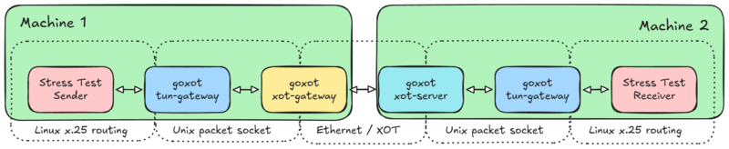
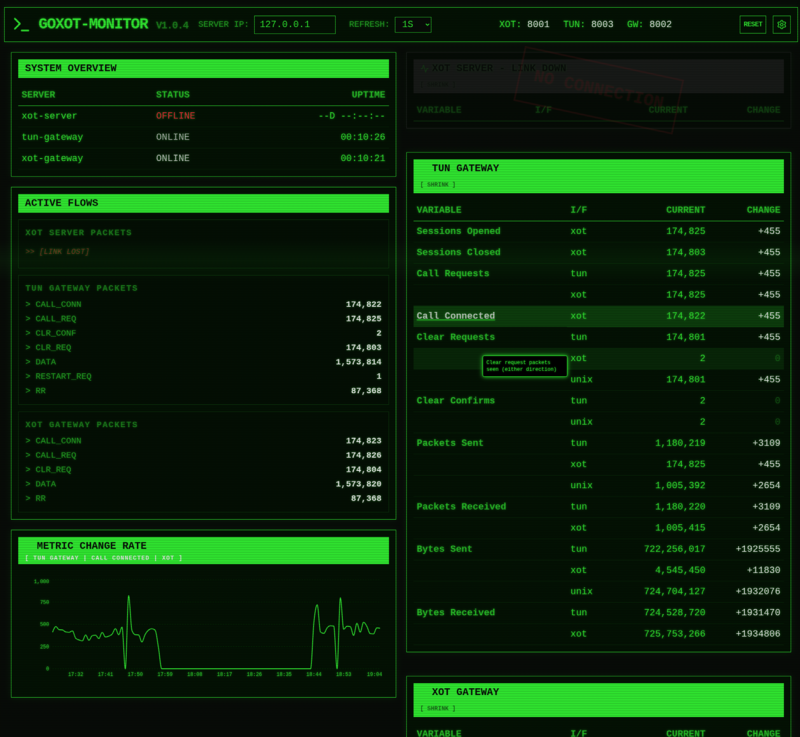

# GoXOT - X.25 over TCP Gateway

This is a Linux command line application suite written in Go that implements RFC 1613 (X.25 over TCP). It bridges a Linux TUN interface with routers that support XOT.

## Architecture

The gateway is split into three distinct processes to improve security and modularity:

1.  **`tun-gateway`**: The only privileged process. It manages the physical Linux TUN device and handles LCI remapping. It listens on a Unix Domain Socket (`/tmp/xot_tun.sock`) for connections from `xot-server`.
2.  **`xot-server`**: An unprivileged process that handles incoming XOT (TCP) connections. It examines the `Call Request` destination and routes the call to either `xot-gateway` (for configured routes) or `tun-gateway` (for local TUN delivery).
3.  **`xot-gateway`**: An unprivileged process that handles outgoing XOT (TCP) connections. It listens on a Unix Domain Socket (`/tmp/xot_gwy.sock`) and connects to remote XOT servers based on the `config.json` routing table.
4.  **`tun-listener`**: An unprivileged diagnostic tool that binds to a specific X.25 address on a Linux interface (typically a TUN interface managed by **tun-gateway**). It accepts incoming X.25 calls and provides real-time diagnostic information to the caller.

Here is a typical setup, combining Linux x.25 routing and TUN devices with XOT:


## Features

- **RFC 1613 Implementation**: Handles XOT framing (4-byte header: 2-byte version + 2-byte length over TCP).
- **Privilege Separation**: Only the TUN-facing component requires root privileges.
- **LCI Remapping**: `tun-gateway` manages unique LCIs for the TUN interface.
- **X.121 Routing**: Flexible routing based on X.121 address prefixes.
- **Trace Logging**: Standardized trace format: `{source}>{destination} {packettype} {hexdump}`.
- **DNS Based Routing**: Look up XOT server addresses from their X.121 address in DNS.
- **Dashboard**: Cool dashboard to see what is happening.
- **Observability**: State and counters are optionally exported via varz.


## Prerequisites

- Go 1.21 or later.
- Linux environment (for TUN interface support).
- Root/Sudo privileges and the Linux x25 module (only for `tun-gateway`).

## Installation

1. Clone or download the source code.
2. Navigate to the `src` directory.
3. Build the binaries:
   ```bash
   go build -o tun-gateway ./cmd/tun-gateway
   go build -o xot-server ./cmd/xot-server
   go build -o xot-gateway ./cmd/xot-gateway
   go build -o tun-listener ./cmd/tun-listener
   ```

## Configuration

The application uses a `config.json` file to define XOT servers.

Example `config.json`:
```json
{
  "xot-server": {
    "stats-port": 8001
  },
  "xot-gateway": {
    "stats-port": 8002
  },
  "tun-gateway": {
    "lci_start": 1,
    "lci_end": 255,
    "stats-port": 8003
  },
  "servers": [
    {
      "prefix": "701",
      "ip": "192.168.1.1",
      "port": 1998
    },
    {
      "prefix": "123",
      "dns_name": "\\2.\\1.example.org",
      "dns_pattern": "^(...)(...)"
    }
  ]
}
```

## Usage (all components are optional)

1. Start **`xot-gateway`** (unprivileged):
   ```bash
   ./xot-gateway -config config.json -trace
   ```

2. Start **`tun-gateway`** (privileged):
   ```bash
   sudo ./tun-gateway -tun tun0 -config config.json -trace
   ```

3. Start **`xot-server`** (unprivileged):
   ```bash
   ./xot-server -listen 0.0.0.0:1998 -config config.json -trace
   ```

4. Start **`tun-listener`** to give yourself something to talk to (unprivileged):
   ```bash
   ./tun-listener -address 127001
   ```

Other tools (such as xotpad) can then be used to connect through the suite, e.g.:
`xotpad -g 127.0.0.1 -a 127111 127001`

## Trace Logging Format

Trace logs follow the format: `{source}>{destination} {packettype} {hexdump}`

- `XOT(IP)`: Remote TCP XOT connection.
- `SVR(FD)`: `xot-server` unixpacket socket.
- `GWY(FD)`: `xot-gateway` unixpacket socket.
- `TUN(0)`: Physical TUN interface.

## Dashboard

Instructions for running the dashboard are in `dashboard/`


