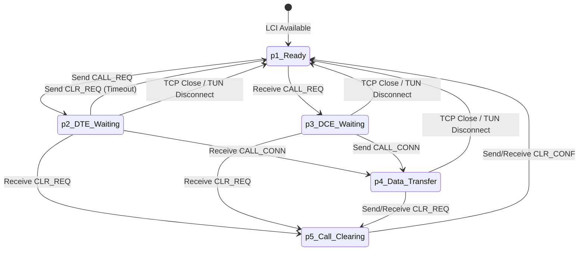

# GoXOT State Management

This document defines the state lifecycle for X.25 sessions and interface-specific rules for handling connections.

## LCI Lifecycle State Diagram

The following diagram illustrates the lifecycle of a Logical Channel Identifier (LCI) within the GoXOT environment.

---

## Definition of Done: TUN Interface Handler

The TUN interface bridge (`tun-gateway`) manages the transition between Linux kernel X.25 sockets and the GoXOT internal relay.

### Mapping the Open state
*   **Interface Initialization**: Interface must be configured as `ARPHRD_X25` and brought `UP`.
*   **Link Handshake**: Mandatory `TunHeaderConnect (0x01)` from the kernel must be echoed back to the kernel.
*   **LCI Allocation**: A unique LCI must be allocated from the `SessionManager` (Side A) and mapped to the incoming TCP session (Side B).

### Mapping the Close state
*   **Session-Specific Clear**: Receipt of an X.25 `CLR_REQ` (as `TunHeaderData`) must trigger the `RemoveSession` call on the `SessionManager`.
*   **Interface Disconnect**: Receipt of `TunHeaderDisconnect (0x02)` from the kernel signals a global link failure.

### Defining Cleanup of all maps and connections
*   **Specific Cleanup**: `sm.RemoveSession(s)` must be called to remove entries from all internal indices.
*   **Global Cleanup**: `sm.GetSessionsForConn(conn)` should be used during TCP connection teardown to ensure all associated virtual circuits are cleared from the mapping tables.

### Validating the state against docs/tech/
*   Verify that `CLR_REQ` packets generated by the gateway use the correct cause/diag (e.g., `0x01/0x00` for routing failures).
*   Ensure the link-layer handshake logic aligns with the [Observed Behaviours](linux_x25_and_tun.md#observed-behaviours).

---

## Definition of Done: XOT Interface Handler

The XOT handlers (`xot-server`, `xot-gateway`) manage the TCP encapsulation defined in RFC 1613.

### Mapping the Open state
*   **TCP Establishment**: A successful socket connection must be formed (server-side `Accept` or gateway-side `Dial`).
*   **Encapsulation Sync**: The handler must be ready to read and write the 2-byte RFC 1613 length header.
*   **Session Binding**: An incoming `CALL_REQ` must be successfully parsed and a route resolved.

### Mapping the Close state
*   **In-Band Clearing**: Receipt of an X.25 `CLR_REQ` within the TCP stream must trigger the teardown of the corresponding session.
*   **Socket Termination**: Detection of a closed TCP socket (`io.EOF`) or connection reset must trigger cleanup for ALL virtual circuits multiplexed on that connection.

### Defining Cleanup of all maps and connections
*   The TCP socket must be explicitly closed.
*   All LCI entries in the global mapping tables that point to this connection must be removed.
*   Corresponding side of the bridge (TUN or peer XOT) must be notified with a `CLR_REQ` or socket close.

### Validating the state against docs/tech/
*   Verify that the 2-byte header correctly reflects the packet length including the X.25 header.
*   Ensure that Cause codes follow the [Comparison Table](x25_cause_diag.md#observed-causediagnostic-usage-comparison).
